# Giro

> Menos desperdício, mais resultado.

O Giro é um aplicativo mobile para pequenos comércios de alimentos controlarem datas de validade e agirem antes que os produtos se percam. Ele destaca itens prioritários e permite registrar oferta, doação ou descarte.

## Projeto semestral — Mobile Development & IoT

| Checkpoint | Entrega contemplada                                                     |
| ---------- | ----------------------------------------------------------------------- |
| CP4        | Conceito, marca, escopo, setup React Native/Expo e modelo de negócio    |
| CP5        | Protótipo funcional, dados mockados, fluxo de telas e roteiro de testes |
| CP6        | App final, persistência local, manual de uso e preparação para APK      |

## Problema e proposta de valor

Pequenos cafés, padarias, mercados e hortifrutis frequentemente controlam validade em papel, planilhas ou pela memória. Isso causa desperdício de alimentos e perdas financeiras.

O Giro transforma uma simples data de validade em uma decisão prática: acompanhar, criar uma oferta, registrar uma doação ou registrar o descarte. Seu público são responsáveis pelo estoque de micro e pequenos comércios alimentícios.

## Funcionalidades

- Painel com itens em dia, em atenção e para agir hoje.
- Cadastro, edição e exclusão de produtos.
- Classificação automática por validade.
- Busca por nome/categoria e filtros de estoque por urgência.
- Registro de oferta, doação e descarte em histórico.
- Persistência local com AsyncStorage.
- Perfil do responsável e estabelecimento editável.
- Preferência de alertas persistente.
- Central de ajuda e restauração segura dos dados de demonstração.
- Login, cadastro de conta e logout com sessão local persistente.
- Avatar e saudação sincronizados com o nome da conta ativa, inclusive após recarregar o app.
- Apresentação institucional interativa acessível pelo login, com navegação por seções, imagens e modelo de negócio.
- Cálculo real da taxa de aproveitamento com base no histórico.
- Fotos realistas locais dos produtos, com fallback para emoji em categorias sem imagem.
- Tela de alertas com prioridades do estoque.
- Tela de oportunidades com sugestões de desconto.
- Relatórios com indicadores e distribuição por categoria.
- Tela de impacto com ofertas, doações, descartes e linha do tempo.

## Marca e identidade visual

- **Nome:** Giro
- **Tagline:** Menos desperdício, mais resultado.
- **Personalidade:** prática, otimista, humana e confiável.
- **Cor principal:** verde `#0D6A49`, associada a aproveitamento e impacto positivo.
- **Cor de ação:** laranja `#E76832`, indicando urgência sem agressividade.
- **Logotipo:** monograma “g” construído por um ciclo de renovação, com folha para representar alimentos e sustentabilidade e selo laranja para indicar um item conferido.
- **Arquivos da marca:** `assets/giro-logo.png` (fundo transparente) e `assets/giro-app-icon.png` (ícone oficial sobre fundo creme).

## Modelo de negócio e diferencial

O Giro utiliza um modelo **freemium**. A versão gratuita atende um estabelecimento; a versão Pro pode oferecer múltiplos usuários, relatórios de perdas, exportação de dados e notificações avançadas.

Ao contrário de uma planilha de validade, o Giro orienta um destino para cada item próximo ao vencimento. Isso ajuda o comerciante a recuperar valor ou gerar impacto social com doações.

## Tecnologias e decisões técnicas

- React Native + Expo, em JavaScript/JSX.
- AsyncStorage para persistência local sem necessidade de backend.
- expo-linear-gradient para o destaque visual do painel.
- @expo/vector-icons para ícones consistentes.
- Hook `useInventory` como camada central das regras de negócio.
- Serviço de armazenamento isolado para facilitar manutenção e evolução.
- Navegação por estado local e abas customizadas para manter o MVP simples e leve.

## Estrutura de pastas

```text
app-mobile/
├── App.jsx                         # Orquestra telas e modais
├── assets/                         # Logo, ícone do app e recursos visuais
│   ├── giro-logo.png               # Marca com fundo transparente
│   ├── giro-app-icon.png           # Ícone quadrado para Android, iOS e web
│   └── products/                   # Fotos locais dos produtos do catálogo
├── src/
│   ├── screens/                    # Uma tela por arquivo JSX
│   │   ├── HomeScreen.jsx
│   │   ├── ProductsScreen.jsx
│   │   ├── HistoryScreen.jsx
│   │   ├── ProfileScreen.jsx
│   │   ├── AlertsScreen.jsx
│   │   ├── OpportunitiesScreen.jsx
│   │   ├── InsightsScreen.jsx
│   │   ├── ImpactScreen.jsx
│   │   ├── LoginScreen.jsx
│   │   ├── SignUpScreen.jsx
│   │   └── ProjectShowcaseScreen.jsx
│   ├── components/                 # Componentes reutilizáveis
│   │   ├── BottomTabs.jsx
│   │   ├── EmptyState.jsx
│   │   ├── FormField.jsx
│   │   ├── ModalHeader.jsx
│   │   ├── ProductCard.jsx
│   │   ├── QuickActionCard.jsx
│   │   ├── ScreenHeader.jsx
│   │   ├── SearchBar.jsx
│   │   └── SettingRow.jsx
│   ├── modals/                     # Formulários e detalhes em modal
│   │   ├── BusinessProfileModal.jsx
│   │   ├── HelpModal.jsx
│   │   ├── ProductDetailModal.jsx
│   │   └── ProductFormModal.jsx
│   ├── hooks/useInventory.js       # Estado e regras de negócio
│   ├── hooks/useAuth.js            # Sessão e cadastro local
│   ├── services/storage.js         # Persistência com AsyncStorage
│   ├── data/initialData.js         # Dados mockados iniciais
│   ├── styles/appStyles.js         # Identidade visual compartilhada
│   └── utils/productDates.js       # Datas, validade e prioridade
├── docs/
└── eas.json
```

## Executando

```bash
npm install
npm start
```

No Expo, pressione `w` para navegador ou `a` para emulador Android. Também é possível ler o QR Code com Expo Go em Android.

## Manual de uso

1. Abra o aplicativo e use **Acessar demonstração** ou toque em **Criar conta**.
2. Na tela de login, toque em **Conheça a ideia do projeto** para abrir a apresentação interativa.
3. Use a navegação **Visão**, **Como funciona**, **Negócio** e **CP4 · CP5 · CP6** para explorar a proposta.
4. Se criar uma conta, informe nome, e-mail e senha; estabelecimento e cidade são opcionais.
5. No painel, toque em **Adicionar produto** e informe nome, categoria, quantidade e validade (`AAAA-MM-DD`).
6. Em **Produtos**, busque ou filtre por urgência e abra um item para ver a recomendação.
7. Registre uma oferta, doação ou descarte. A ação fica guardada no histórico.
8. Em **Conta**, edite o estabelecimento, configure os alertas, abra a ajuda ou saia da conta.
9. Na página inicial, abra Alertas, Oportunidades, Relatórios ou Impacto.
10. A conta, sessão e dados do estoque permanecem salvos localmente no dispositivo.

## Testes e evidências

O roteiro manual está em [docs/roteiro-de-testes.md](docs/roteiro-de-testes.md). As evidências abaixo foram capturadas diretamente da prévia web do aplicativo, com a interface em estado funcional.

## Evidências visuais

| Fluxo | Print |
| --- | --- |
| Login | 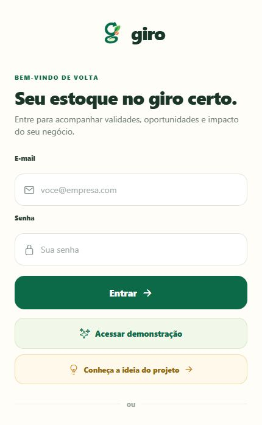 |
| Cadastro de conta | 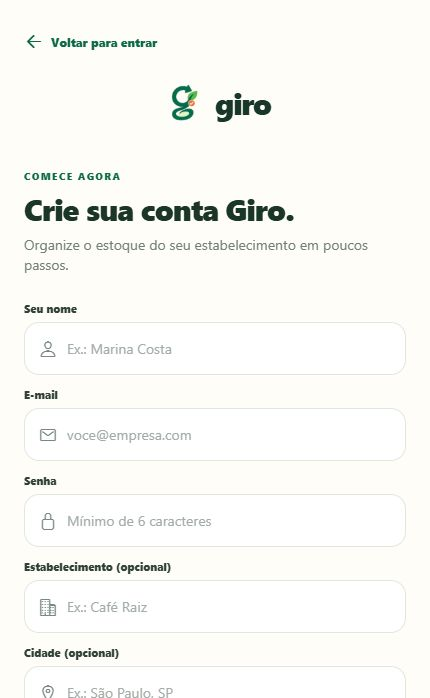 |
| Apresentação do projeto | 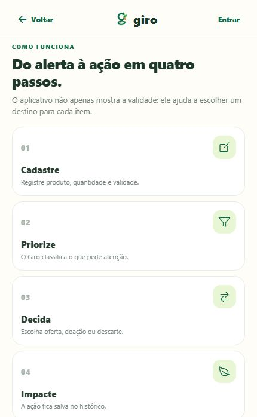 |
| Apresentação — modelo de negócio | 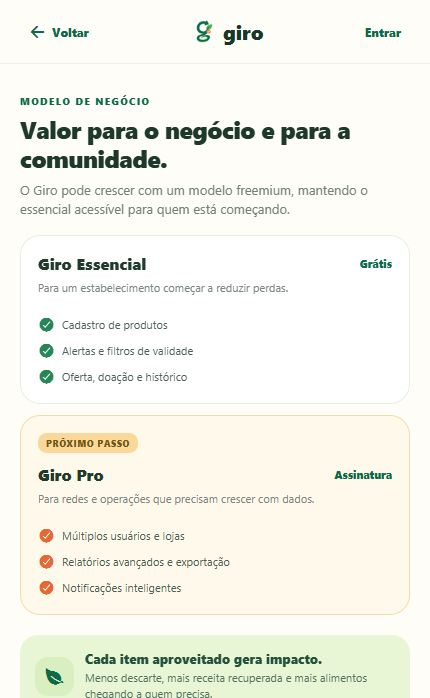 |
| Apresentação — CP4, CP5 e CP6 | 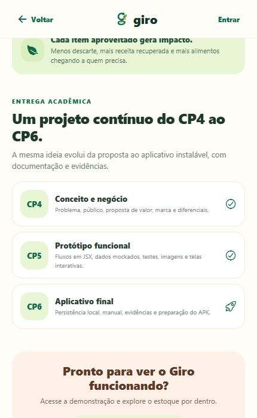 |
| Painel inicial | 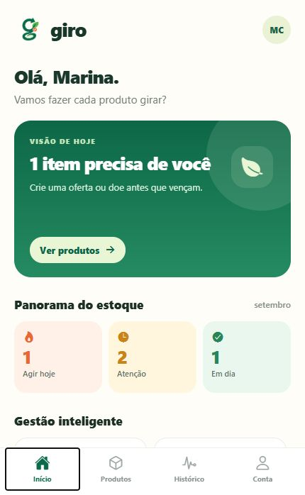 |
| Lista de produtos | 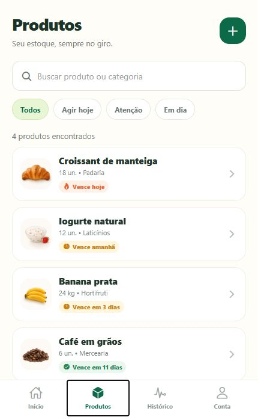 |
| Detalhe e ações do produto | 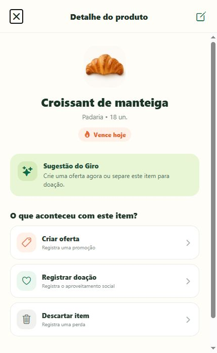 |
| Histórico | 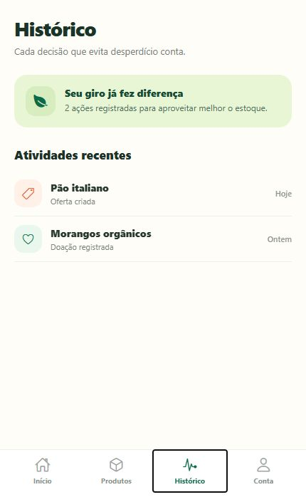 |
| Conta e configurações | 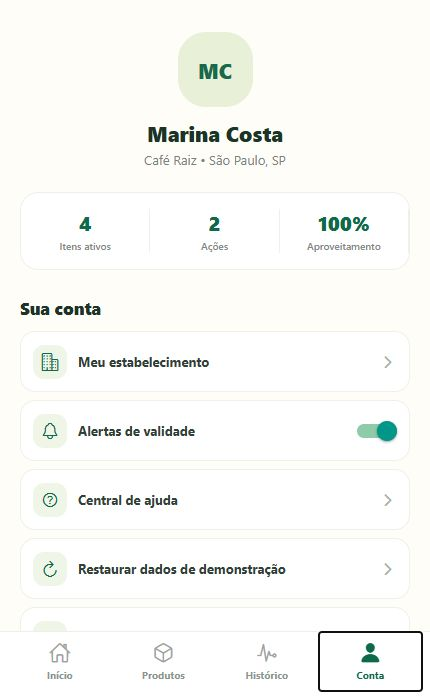 |
| Alertas | 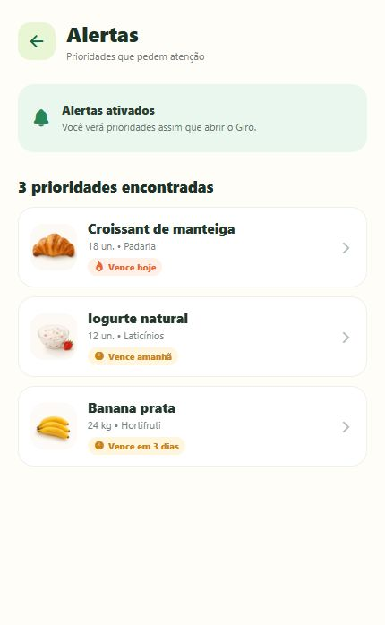 |
| Oportunidades | 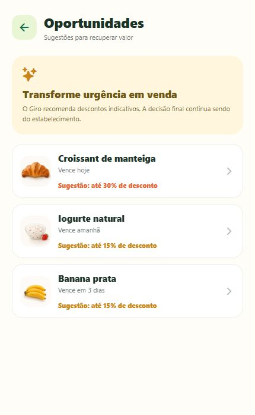 |
| Relatórios | 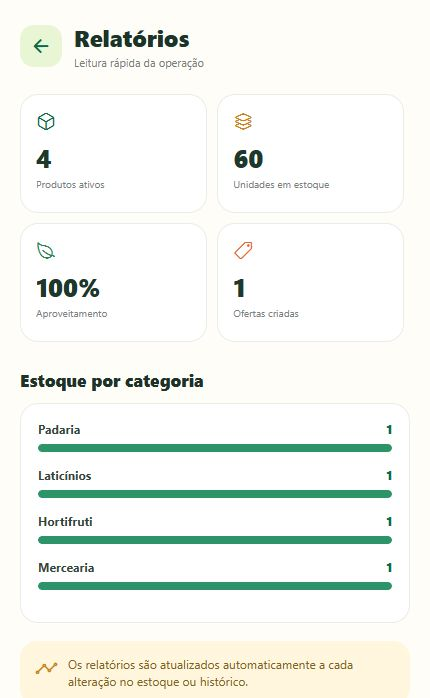 |
| Impacto | 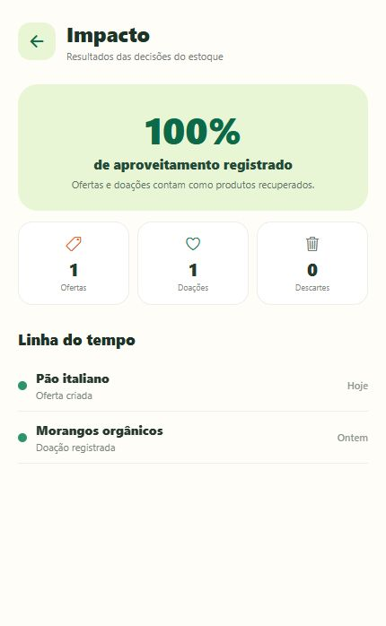 |
| Cadastro de produto | 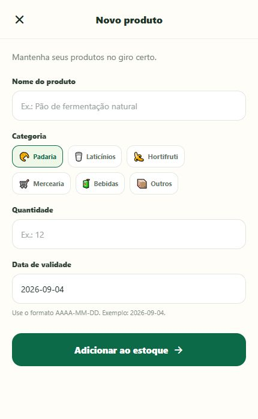 |
| Filtro “Agir hoje” | 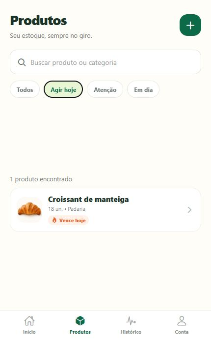 |

Os arquivos originais estão em [docs/evidencias](docs/evidencias). Para o CP6, ainda é importante gravar um vídeo curto navegando no app e anexar o print do APK instalado em um aparelho Android.

## Gerar APK (CP6)

```bash
npm install -g eas-cli
eas login
eas build:configure
eas build --platform android --profile preview
```

O último comando fornece, na conta Expo conectada, um link para baixar o APK instalável.

## Status para finalizar a entrega

- [x] Aplicativo funcional em React Native/Expo com telas, modais e persistência local.
- [x] Login, cadastro, logout e sincronização do avatar com sessão local testados.
- [x] Identidade visual, logo, ícone e favicon configurados.
- [x] Roteiro de testes e 16 prints de evidência adicionados ao repositório.
- [x] Build web validado com `npx expo export --platform web`.
- [x] Expo Doctor aprovado com 21/21 verificações.
- [ ] Gerar o APK pelo EAS usando a conta Expo do grupo.
- [ ] Instalar o APK em Android e anexar print/vídeo da execução real.

## Integrantes e papéis

> Papéis sugeridos para organizar a apresentação; ajuste-os caso a divisão real do grupo seja diferente.

| Integrante | RM | Papel desempenhado |
| --- | --- | --- |
| Vinicius Henrique | RM556908 | Product Owner e documentação |
| Enzo Dias | RM558225 | Desenvolvimento React Native |
| Gustavo Pierre | RM558928 | Design e identidade visual |
| Gabriel Belo | RM551669 | QA e testes |
| Laura Souza | RM556320 | Dados, IoT e apresentação |
